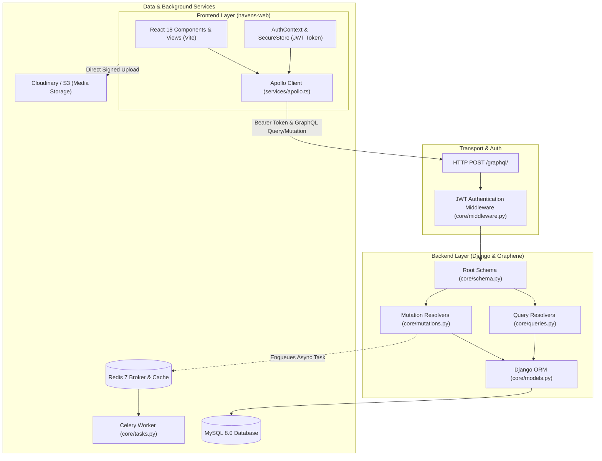

# Contributing to Havens

Welcome to the **Havens** project! This guide is designed to help new developers quickly understand the tech stack, system architecture, development workflow, and coding conventions.

---

## 1. Project Overview & Tech Stack

Havens is a white-label community matching and meetup platform. It connects community members via interest/hobby matchmaking, curated event discovery with geographic proximity calculations, and RSVP coordination.

### Technology Stack Summary

| Layer | Technologies | Role & Purpose |
|---|---|---|
| **Frontend** | **React 18**, **Vite**, **TypeScript**, **Tailwind CSS** | Fast, modern Single-Page Application (SPA) with responsive UI. |
| **State & API Client** | **Apollo Client 3**, **GraphQL** | Typed GraphQL queries, mutations, cache management, and reactive auth links. |
| **Backend Framework** | **Django 4.2+ (Python 3.10+)** | Robust ORM, authentication system, admin interface, and business logic. |
| **GraphQL Engine** | **Graphene-Django**, **django-graphql-jwt** | Single `/graphql/` endpoint handling strongly typed schemas and JWT authentication. |
| **Database** | **MySQL 8.0** (or SQLite in local non-Docker mode) | Relational persistence for users, profiles, communities, events, tickets, and messages. |
| **Task Queue & Cache** | **Celery 5**, **Redis 7** | Asynchronous non-blocking background workers (e.g., automated welcome emails). |
| **Media & Storage** | **Cloudinary** / **AWS S3** | Direct client-to-cloud signed asset uploads for profile avatars and event banners. |
| **Infrastructure** | **Docker** & **Docker Compose** | Standardized containerization for frontend, backend, database, and cache. |

---

## 2. Architecture & Layer Connectivity

Havens follows a clean client-server architecture centered around a single GraphQL entry point.



### Data Flow Lifecycle
1. **Request Initiation**: React components trigger queries or mutations using typed Apollo hooks (`useQuery`, `useMutation`).
2. **Auth Header Injection**: `services/apollo.ts` retrieves the JWT token from `localStorage` (`secureStore.ts`) and attaches it as `Authorization: JWT <token>` or `Authorization: Bearer <token>`.
3. **Middleware Processing**: `core/middleware.py` intercepts incoming requests, validates the JWT, and sets `request.user` to the authenticated Django User.
4. **GraphQL Execution**: `core/schema.py` routes the operation to `core/queries.py` or `core/mutations.py`. Decorators such as `@login_required` enforce permission boundaries.
5. **Database Interaction**: Resolvers use Django ORM to query/mutate MySQL with prefetching (`select_related`, `prefetch_related`) and database-level trigonometric annotations (Haversine formula for distance).
6. **Asynchronous Jobs**: Heavy tasks (such as sending emails) are offloaded to Celery via `.delay()` and processed asynchronously via Redis.

---

## 3. Local Development Quickstart

### Prerequisites
- **Docker Desktop** (recommended)
- **Node.js** >= 18.x
- **Python** >= 3.10
- **Git**

---

### Option A: Running with Docker Compose (Recommended)

1. **Clone the repository**:
   ```bash
   git clone <repository-url>
   cd "P HAVENS"
   ```

2. **Set up Environment Variables**:
   Copy `.env.example` to `.env`:
   ```bash
   cp .env.example .env
   ```
   Fill in your local secrets (MySQL credentials, JWT secret, Cloudinary keys).

3. **Build and start all containers**:
   ```bash
   docker compose up --build
   ```

4. **Run Database Migrations and Seed Taxonomy**:
   In a separate terminal window:
   ```bash
   docker compose exec web python manage.py migrate
   docker compose exec web python manage.py seed_hobbies
   ```

5. **Access the Services**:
   - **Frontend App**: `http://localhost:5173`
   - **Backend GraphQL IDE**: `http://localhost:8000/graphql/`
   - **Django Admin**: `http://localhost:8000/admin/`

---

### Option B: Running Locally (Without Docker)

#### Backend Setup:
```bash
# 1. Create and activate virtual environment
python -m venv venv
# Windows:
.\venv\Scripts\activate
# Linux/macOS:
source venv/bin/activate

# 2. Install dependencies
pip install -r requirements.txt

# 3. Apply database migrations
python manage.py migrate

# 4. Seed initial hobbies taxonomy
python manage.py seed_hobbies

# 5. (Optional) Create superuser
python manage.py createsuperuser

# 6. Start Django server
python manage.py runserver
```

#### Frontend Setup:
```bash
cd havens-web
npm install
npm run dev
```

---

## 4. Key Management Commands & Workflows

### Seeding Hobbies
The platform requires categorized hobbies for user onboarding and event affinity scoring:
```bash
python manage.py seed_hobbies
```

### Generating an Invitation Code
Registration requires an invitation code. You can generate one via:
- The GraphQL mutation `generateInvite` (authenticated user).
- Django Admin interface under `Invitation Codes`.
- Django Shell:
  ```python
  python manage.py shell
  >>> from django.contrib.auth.models import User
  >>> from core.models import InvitationCode
  >>> admin = User.objects.filter(is_superuser=True).first()
  >>> invite = InvitationCode.objects.create(created_by=admin)
  >>> print(f"Invite Code: {invite.code}")
  ```

---

## 5. Code Structure & Development Guidelines

### Project Directory Layout
```
├── core/                   # Django backend application
│   ├── models.py           # ORM database models
│   ├── schema.py           # Root GraphQL schema entry point
│   ├── queries.py          # Read resolvers & filtering logic
│   ├── mutations.py        # Write resolvers & business logic
│   ├── types.py            # Graphene ObjectType mappings
│   ├── tasks.py            # Celery asynchronous background tasks
│   ├── middleware.py       # JWT & CORS authentication middleware
│   └── management/         # Custom management commands (seed_hobbies)
├── havens/                 # Django project settings & configuration
│   ├── settings.py         # App configuration & environment parsing
│   ├── urls.py             # Route definitions (/graphql, /admin)
│   └── celery.py           # Celery broker configuration
├── havens-web/             # Frontend React + Vite application
│   └── src/
│       ├── components/     # Reusable UI components
│       ├── context/        # React context providers (AuthContext, AppContext)
│       ├── graphql/        # GraphQL operations and document definitions
│       ├── pages/          # Primary page views (Discover, Social, Plans, Profile)
│       └── services/       # Apollo Client setup & secure storage
├── docker-compose.yml      # Multi-container orchestration definition
└── requirements.txt        # Python backend package dependencies
```

### Backend Guidelines
1. **Preserve Business Logic**: Never bypass model integrity or ownership validation.
2. **Docstrings & Typing**: All new queries, mutations, and models must include Google-style Python docstrings with detailed `Args` and `Returns`.
3. **Database Performance**:
   - Always prefetch related models using `.select_related()` (for OneToOne/ForeignKey) or `.prefetch_related()` (for ManyToMany/Reverse FK).
   - Use database-level annotations for calculations (e.g. Haversine distance, count aggregations).
4. **Security**: Ensure all user-scoped mutations and queries are protected with `@login_required` and verify that `request.user` owns the target resource.

### Frontend Guidelines
1. **TypeScript First**: Write all new components and utilities in `.tsx` / `.ts` with explicit type annotations.
2. **Modular Components**: Keep page views lean by extracting sub-components and custom hooks instead of monolithic "God Object" files.
3. **GraphQL Operations**: Keep queries and mutations organized in `graphql/` with fragments for reusable fields.

> [!TIP]
> **Modularity & Refactoring Blueprint:**  
> Refer to [`MODULARITY_AUDIT.md`](file:///c:/Users/trian/Desktop/P%20HAVENS/MODULARITY_AUDIT.md) for step-by-step extraction recipes, target file structures, and edge-case troubleshooting for oversized views (`Plans.tsx`, `Social.tsx`, `Onboarding.tsx`, `core/mutations.py`).

---

## 6. Pull Request & Branching Workflow

1. **Branch Naming**:
   - `feature/<feature-name>` (e.g., `feature/event-calendar-export`)
   - `fix/<bug-name>` (e.g., `fix/jwt-auth-expiration`)
   - `refactor/<module-name>` (e.g., `refactor/modular-mutations`)
2. **Commit Messages**: Follow Conventional Commits:
   - `feat: add Google Calendar sync mutation`
   - `fix: resolve null pointer on anonymous discovery feed`
   - `docs: add docstrings to GraphQL resolvers`
3. **Submitting a PR**:
   - Ensure all Python files compile cleanly (`python -m py_compile ...`).
   - Ensure frontend builds without errors (`npm run build` in `havens-web`).
   - Describe the changes made, verification steps, and attach screenshots for UI updates.
