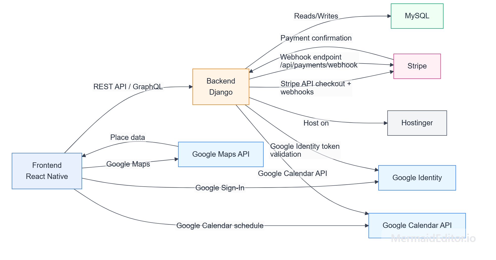
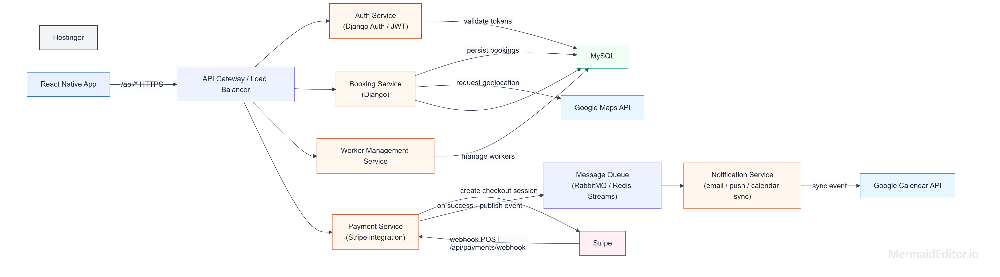
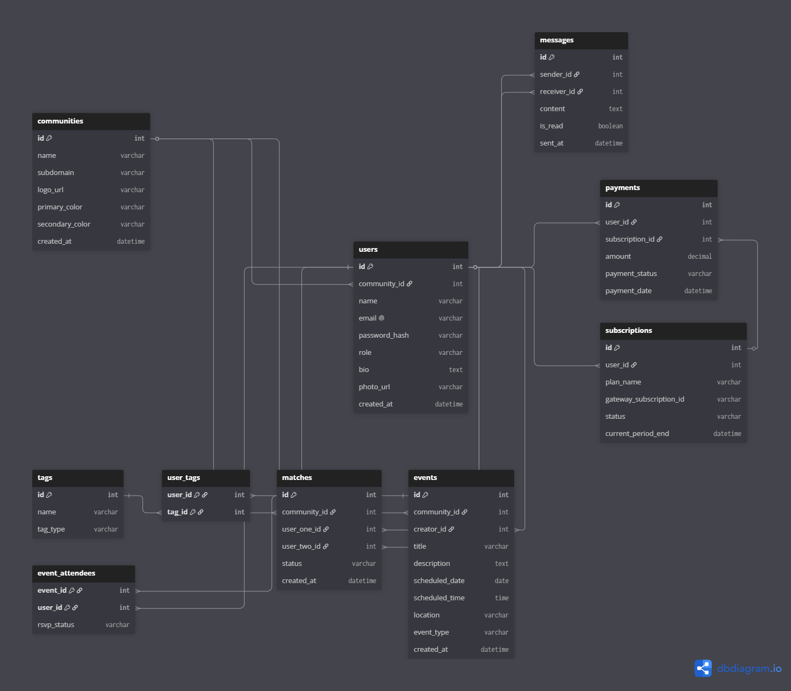

# **Capstone Project**
## **HAVENS (MVP)**
### *White-Label Community Matching Platform*

---

## **Week 1**

### 1. Project Title & Vision

This project aims to develop a **white-label community-matching platform** that helps existing communities turn members into real relationships. It offers a private, branded space where people can connect, match, and meet, while providing community leaders with lightweight tools to oversee engagement.

---

### 2. Problem Statement

The application will allow **members** to:

- Join a white-label community instance.
- Register and log in flexibly via email and password or Google Sign-In.
- Complete an onboarding profile with interests, goals, and preferences.
- Discover system-recommended matches or small group suggestions.
- Accept curated introductions or engage with a suggested connection.
- Coordinate a real conversation, meetup, or group interaction using simple RSVP mechanics.
- Manage their payments and subscriptions securely.

**Administrators** will be able to:

- Access a basic admin view for managing members and seeing high-level activity.
- Review simple metrics like signups, profiles completed, matches made, and introductions accepted.
- Update the white-label visual identity of their space.

---

### 3. Brief Overview of the Application's Functionality

Havens is an application where members of trusted communities can join a tailored space, complete a meaningful profile, receive curated matches, and seamlessly coordinate in-person meetups. This supports real-world connection through a branded Havens experience.

---

### 4. Technology Stack

- **Frontend:**
  1. **React Native** — For building a flexible, cross-platform mobile interface.
  2. **Dynamic Styling** — To support soft, earthy colors and white-label branding per community.

- **Backend:**
  1. **Django (Python)** — Core framework for processing the matching logic, sessions, and GraphQL API endpoints.
  2. **Graphene-Django** — For building and serving the GraphQL API.

- **Authentication & Security:**
  1. **JWT (JSON Web Tokens)** — Primary system for secure authentication, session creation, and route protection.
  2. **Google Sign-In API** — Optional integration for one-click access.
  3. **Celery & Redis** — For handling asynchronous background tasks (e.g., email notifications).

- **Database:**
  1. **MySQL** — Relational database engine for the persistence of profiles, events, and metrics.
  2. **Django ORM** — To easily map and query data from the backend.

- **Extras & Third-Party Integrations:**
  1. **Email Notifications** — Service via SendGrid or Django Core Mail to alert users about new matches, RSVP confirmations, and event reminders.
  2. **Stripe / PayPal API** — To process payments and manage the subscription model.
  3. **Google Maps API** — To display and share physical meetup locations.
  4. **Google Calendar API** — To automatically schedule confirmed meetups on members' calendars.

- **Infrastructure & Version Control:**
  1. **Docker** — For local containerized development (Django, MySQL, Redis, Celery).
  2. **Hosting** — Hostinger for backend and database deployment.
  3. **Version Control** — GitHub for version control, collaboration, and pull requests.

---

### 5. Core Routing (Frontend)

| Route | Description |
|---|---|
| `/` | Home — Dynamic loading of the white-label subdomain |
| `/login` | Member login and account creation (JWT or Google) |
| `/onboarding` | Profile setup, tag selection, and goals |
| `/discovery` | Dashboard to view recommended members and groups |
| `/meetups` | Area to manage invitations, RSVP, and view locations |
| `/messages` | Internal chat for members who have accepted a match |
| `/subscription` | Payment configuration and plan status |
| `/admin` | Private community management view for administrators |

---

## **Week 2**

### 1. High-Level Design

#### Color Palette & UI Mockups

> UI Interface & Palette Design:
> https://www.figma.com/make/F6Iy4uO1gYVmJ8I8L9kzYK/Color-Palette-Design?t=i1yAyqlJ6oFTTiNp-1&preview-route=%2Ffeatures

#### High-Level Architecture Diagrams

> 
> 

#### User and Administrator Flows

- **Admin Flow:** https://mermaid.ai/d/2e5f4c73-8a86-40b4-bd0e-9b6cc6604948
- **User Flow:** https://mermaid.ai/d/8055569a-b5f7-4642-b106-924fbf757f1e

---

### 2. Database Schema Design

**Schema Diagram:** https://dbdiagram.io/d/6a234bbed2fbd72c4d63518a

- **Tables:**
  1. `community`
  2. `user`
  3. `tag`
  4. `user_tag`
  5. `match`
  6. `event`
  7. `event_attendee`
  8. `message`
  9. `subscription`
  10. `payment`

- **Relationships:**
  - A community can host many users, matches, and events.
  - A user belongs to one specific community.
  - A user can have many tags (interests and goals), and a tag can be shared by many users.
  - A match connects exactly two users for a potential introduction.
  - A user can organize many events and attend many events.
  - An event can have many attendees (users) with their own RSVP status.
  - A user can send and receive many messages to and from other users.
  - A user can have a subscription, which in turn can have many linked payments.

- **Entity-Relationship Diagram (ERD):**

> 

---

### 3. API Architecture, Request Formats, and Authorization (GraphQL)

The Havens API marks a paradigm shift from traditional REST architectures by utilizing **GraphQL**. This allows the React Native frontend to fetch exact data structures, avoiding over-fetching and under-fetching.

- **Single Endpoint:** Every request is routed through `POST /graphql/`.
- **Operations:** Uses Queries (for READ operations) and Mutations (for CREATE, UPDATE, DELETE).

#### Authorization

- Uses **JWT (JSON Web Tokens)** for protected queries and mutations.
- Required header for authenticated operations:

```
Authorization: Bearer <your_token_here>
```

#### CRUD Operations Map

- **USER & PROFILE**
  - CREATE (Mutation): Register a new user.
  - READ (Query): View own profile, bio, interests, and tags.
  - UPDATE (Mutation): Edit bio, connection preferences, and profile picture.
  - DELETE (Mutation): Delete account and credentials.

- **COMMUNITY**
  - READ (Query): Fetch visual branding (logo, colors) on app launch.
  - UPDATE (Mutation): Admin updates design/name.
  - READ (Query): Admin views metrics (signups, matches).

- **MATCHES**
  - READ (Query): View curated list of suggested compatible profiles.
  - UPDATE (Mutation): Accept/Decline introduction.
  - READ (Query): Load history of accepted connections.

- **EVENTS**
  - CREATE (Mutation): Create a small group gathering.
  - READ (Query): View available events and locations.
  - UPDATE (Mutation): Confirm attendance (RSVP).
  - DELETE (Mutation): Cancel RSVP.

- **PAYMENTS**
  - CREATE (Mutation): Generate Stripe checkout session.
  - READ (Query): Retrieve subscription status.

#### GraphQL Operations Table

| Entity | Type | Operation Name | Description | Auth Required |
|---|---|---|---|---|
| Auth | Mutation | `createUser` | Register a new member to the platform | No |
| Auth | Mutation | `tokenAuth` | Login to receive the JWT access token | No |
| Profile | Query | `myProfile` | Fetch user info, bio, and associated tags | Yes |
| Profile | Mutation | `updateProfile` | Modify personal info and preferences | Yes |
| Community | Query | `communityBranding` | Fetch instance colors, logo, and title | No |
| Matches | Query | `suggestedMatches` | List compatible profiles based on the algorithm | Yes |
| Matches | Mutation | `acceptMatch` | Confirm interest in a suggested profile | Yes |
| Events | Query | `upcomingMeetups` | List available small group gatherings | Yes |
| Events | Mutation | `rsvpEvent` | Confirm or cancel attendance to a meetup | Yes |
| Payments | Mutation | `createCheckout` | Initialize Stripe payment flow | Yes |

#### Sample GraphQL Requests

**Sample Query — Get User Profile:**
```graphql
query {
  myProfile {
    id
    username
    bio
    interests {
      name
    }
  }
}
```

**Sample Mutation — RSVP to Event:**
```graphql
mutation {
  rsvpEvent(eventId: 15, status: "ACCEPTED") {
    success
    message
    event {
      title
      currentAttendees
    }
  }
}
```

---

## **Week 3 — Development Progress: Backend**

### Infrastructure & Docker Setup

- Initialized the Docker environment using a custom `docker-compose.yml` to orchestrate four containers: `web` (Django), `db` (MySQL), `redis` (Broker), and `celery` (Asynchronous worker).
- Configured `requirements.txt` incorporating dependencies including Django 4.2, `mysqlclient`, `graphene-django`, `celery`, `redis`, and `python-dotenv`.
- Established environment variables (`.env`) to securely map the database credentials across containers.

### Database Initialization & Django Setup

- Successfully initialized the MySQL database container on port `3306` (mapped to `3307` locally to avoid system conflicts).
- Resolved Docker caching issues using container wipes (`docker compose down -v`) to synchronize secure root passwords.
- Executed initial `python manage.py migrate` to structure the core Django administrative and session tables.
- Created the primary Superuser to gain access to the Django Admin Panel.
- Initialized the primary application module named `core` and registered it in `settings.py`.

### GraphQL Integration

- Installed and configured `graphene-django` in the project settings.
- Defined the single API endpoint `path('graphql/', GraphQLView.as_view(graphiql=True))` in the main `urls.py`.
- Created the foundational `schema.py` routing in the `core` app and linked it to the master schema.
- Successfully tested the architecture using Postman with a "Hello World" root query, returning a `200 OK` response with JSON data, confirming the container network and GraphQL endpoint are fully operational.

---

## **References**

*To be completed.*

---

*Last updated: June 2026* 